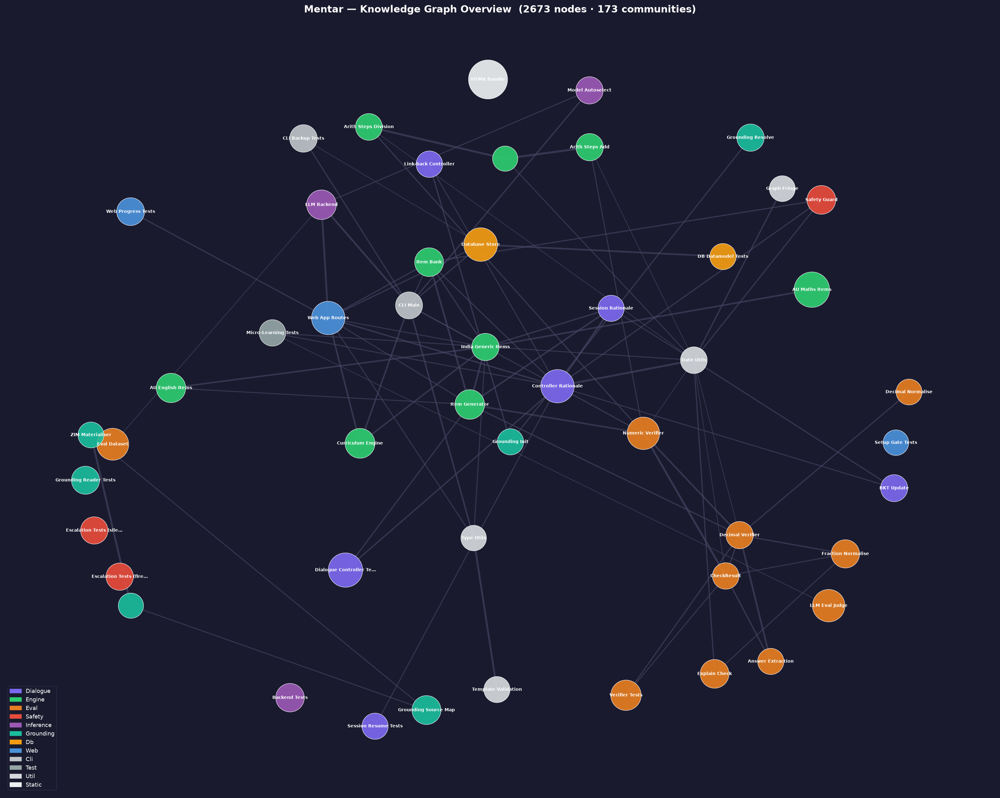

# Mentar

**OSS-first AI tutor for children that supplements — never replaces — school education.**

Local LLM hosting. Curriculum-templated by country and year level. Built-in kid safety from day one.

▶️ **Want to run it?** See **[docs/RUNNING.md](docs/RUNNING.md)** — a 6-step quick start for Windows, macOS (incl. MacBook Pro M1 16 GB) and Linux.

> ⚠️ **Research preview — supervised pilot only.** Mentar is pre-1.0 and **not** ready for
> unsupervised use with real children (known safety gaps: no emergency-services signposting,
> handoff wording not yet professionally reviewed, no PIN gate). Use only with a parent/carer
> present. See **[SECURITY.md](SECURITY.md)** before running it with a child.

---

## What it is

Mentar is an open-source tutoring framework that lets parents run an AI tutor on their own hardware, with no data leaving the device and no per-seat API fees. The core is three components:

- **Template engine** — Markdown curriculum files per country + year/grade level, used as learning guidelines. Community-extensible.
- **Dialogue framework** — Scaffolds tutoring conversations within the bounds of the active curriculum template.
- **Safety layer** — Content guardrails and age-mode logic baked in, not bolted on. This is the non-negotiable bar the project must clear to justify existing.

---

## How this is built — an honesty note

Mentar is, candidly, **AI-built software**. The great majority of the code, tests, and docs in this
repo are written by AI agents working under a human maintainer's direction, decisions, and review —
**not hand-written by a person**. In that sense it is close to "vibe coding," even though it follows
deliberate engineering discipline: spec-first design, test-driven development (790+ tests gating
changes), design docs before code, versioned prompts, and code review. Those principles raise the
quality bar — but they don't change that underlying fact, and we'd rather be upfront about it.

What this means for you:

- **The human makes the decisions** (scope, safety thresholds, model choices, architecture); the AI
  executes and advises. Changes are test-gated and reviewed — but the author is AI.
- **It has not had a professional, independent audit.** In particular, the **child-safety** code and
  spec are AI-authored and reviewed by AI plus the maintainer — *not* by a qualified safeguarding,
  security, or child-development professional. The safety spec's own rollout guards
  ([`docs/SAFETY.md`](docs/SAFETY.md)) require that review **before** any use beyond a single,
  supervised pilot.
- Treat the project accordingly: carefully built and openly documented, but **not yet independently
  verified**. Read the code, run the tests, and do not put it in front of a real child outside a
  supervised pilot until the open safety items are closed.

---

## Why local-first

Two reasons:

1. **Privacy** — children's data never leaves the device. No operator collects it. This is also a major compliance advantage (see `compliance/`).
2. **Cost** — no per-seat API fees. A parent with a capable laptop or homelab machine pays nothing to run inference.

A paid hosted-inference tier (for non-technical parents) is a planned future bridge, but it carries its own heavier compliance obligations. The OSS local edition stays deliberately data-light by design.

---

## Architecture

The codebase uses a Python **src-layout** (`src/mentar/`); specs and the safety spec live
under `docs/` (not in a top-level `safety/`). See [`docs/ARCHITECTURE.md`](docs/ARCHITECTURE.md)
for the authoritative layout.

```
mentar/
├── curriculum/              # Markdown curriculum templates (concept graphs)
│   ├── _template.md         # Authoring format for new curricula
│   ├── visual_scaffolds/    # Per-topic visual-hint bundle (maths/english/science)
│   └── templates/
│       ├── AU_ACARA/        # Australian Curriculum v9 (maths Y2–12, English Y2–8, science Y2–8)
│       ├── IN_GENERIC/      # India board-agnostic (maths + English, Classes 2–8)
│       ├── SG_GENERIC/      # Singapore board-agnostic (Primary 2 – Secondary 2)
│       ├── US_GENERIC/      # US board-agnostic (Grades 2–8)
│       ├── _pilot/          # Phase-0 fractions/arithmetic/science pilot graph
│       └── practice/        # Country-agnostic evergreen practice content
├── prompts/                 # Versioned prompt templates + prompts/README.md registry (W6.2)
├── src/mentar/              # Python package (src-layout)
│   ├── engine/              # Concept graph (KST), BKT mastery, fringe, probe classifier,
│   │                        #   item generators (see "How curriculum content is made" below)
│   ├── dialogue/            # Turn-loop controller (session state machine)
│   ├── safety/              # Safety-layer implementation (escalation, output guard, filters)
│   ├── grounding/           # ZIM reader + resolver + data-wrapper (retrieval grounding)
│   ├── inference/           # LLM abstraction layer (swappable backends)
│   ├── eval/                # Deterministic verifiers + model-eval harness
│   ├── db/                  # Local SQLite store (schema + access + adapter)
│   ├── tools/               # Template validator, doc-path checker, etc.
│   ├── cli/                 # Command-line entry points
│   └── web/                 # `mentar serve`'s Flask app (learner + parent views)
├── tests/                   # Mirrors the src/ layout
├── docs/                    # SPEC, PHASE0(+_STATUS), SAFETY, SESSION_FSM, ARCHITECTURE,
│                            #   TESTS, CONTENT_LICENSES, PILOT_CONSENT, design/, research/
├── compliance/              # Compliance coverage-status map (points back to docs/)
└── eval/                    # Eval datasets/outputs (data is gitignored)
```

### How curriculum content is actually made (read this before assuming what a ZIM download unlocks)

**Every question a child sees today is hand-authored** — a parametric formula (maths: e.g. random
addition within a range) or a curated fact table (English/science: e.g. a synonym-pair list),
written directly in Python and self-validated against hundreds of random draws before shipping.
**Grounding (the ZIM/retrieval machinery below) is wired to exactly one pack — the original 8-node
Phase-0 fractions pilot.** All of AU_ACARA / IN_GENERIC / SG_GENERIC / US_GENERIC / practice (every year,
every subject) works today with **zero ZIM download** — there is no correlation between grade level and grounding need
in the current build. Grounding, where it exists, only adds a quoted reference passage to an
*explanation* — it never generates a question or decides correctness; that's always the
deterministic verifier, never the LLM.

This is a deliberate, proven design for the content it covers (see
[`docs/EXPLAIN_METHOD_AUDIT.md`](docs/EXPLAIN_METHOD_AUDIT.md) for a full audit), but it doesn't
scale to broader/deeper subject coverage by itself — a **hybrid** direction (keep hand-authoring
where it fits; add a retrieve→extract→verify→freeze pipeline sourced from real ZIM content for
subjects that need it) has been ratified but **not yet built** — see
[`docs/design/hybrid_content_architecture.md`](docs/design/hybrid_content_architecture.md) for the
reasoning, including a live test showing why an ungrounded LLM can't just be asked for facts
directly (a small model got a chemistry equation's *final answer* right while its shown
*reasoning* was fabricated nonsense).

**Licence note if you ever wire in Khan Academy ZIM content**: Khan Academy is **CC
BY-NC-SA** — fine for this local/personal edition, but the **NC (non-commercial) clause
blocks any paid or hosted tier** built on it. See
[`docs/CONTENT_LICENSES.md`](docs/CONTENT_LICENSES.md) §3 for the full breakdown before
building anything on top of it.

### Codebase knowledge graph

The diagram below is generated by [Graphify](https://github.com/Graphify-Labs/graphify) from the live codebase — each bubble is a community of related modules, sized by node count and coloured by architectural layer. Regenerate with `graphify path` / `graphify explain` after a significant refactor.



| Colour | Layer |
|--------|-------|
| 🟣 Purple | Dialogue / Session controller |
| 🟢 Green | Curriculum engine & item generators |
| 🟠 Orange | Eval, verifiers & dataset harness |
| 🔴 Red | Safety & escalation layer |
| 💜 Slate | LLM inference backend |
| 🩵 Teal | Grounding (ZIM / KA) |
| 🟡 Amber | Database store |
| 🔵 Blue | Web app & routes |
| ⬜ Grey | Tests, CLI, utilities |

---

## Curriculum templates

Templates are simple Markdown files that define what topics a child at a given country + year level should be learning. They are **guidelines**, not scripts — the dialogue framework uses them to keep sessions on-topic and age-appropriate.

Shipping today (71 templates, 319 nodes):

| Pack | Coverage | Alignment |
|---|---|---|
| `AU_ACARA/` | Maths Y2–12 · English Y2–8 · Science Y2–8 | ACARA v9 (CC BY 4.0); science codes marked provisional |
| `IN_GENERIC/` | Maths + English, Classes 2–8 | **None claimed** — NCERT/CBSE/ICSE licences don't permit it |
| `SG_GENERIC/` | Maths + English, Primary 2 – Secondary 2 | **None claimed** — Singapore MOE material is all-rights-reserved |
| `US_GENERIC/` | Maths + English, Grades 2–8 | **None claimed** — Common Core's licence carries a purpose clause + trademark |
| `_pilot/`, `practice/` | Fractions pilot; country-agnostic practice | n/a |

The `*_GENERIC` packs deliberately claim no syllabus alignment — the level names are display
labels, not assertions about what a country teaches in that year. Licence reasoning per pack:
[`docs/CONTENT_LICENSES.md`](docs/CONTENT_LICENSES.md) §2b.

Anyone can add a new country or year-level template. See `curriculum/_template.md` for the format.

---

## Safety

Kid-safe content blocks and age-appropriate responses are non-negotiable and built in from the start. See [`docs/SAFETY.md`](docs/SAFETY.md) for the full 6-layer spec (implementation lives in `src/mentar/safety/`).

Key commitments:
- No dark patterns, no compulsive gamification mechanics (legal line under EU AI Act Article 5)
- No emotion recognition or mood inference
- Under-13: parent-mediated mode (parent in the loop, child never alone with AI)
- 13+: more independent with parental oversight available
- Hard block: model must never produce sexual content involving minors

---

## Compliance

The OSS local edition is data-light by design, which removes most direct developer exposure under COPPA, GDPR-K, and similar frameworks. However, obligations are real and documented.

See `compliance/README.md` for coverage status — what's mapped, what's incomplete, and where contributors can help.

---

## LLMs

Mentar is designed to work with smaller OSS models suited to educational dialogue. Low hallucination is critical for a children's tutor. The inference layer is abstracted so users can swap models.

Current evaluation status: see `docs/llm-compatibility.md`.

Hardware requirements: see `docs/hardware-requirements.md`.

---

## Documentation

Full index: **[`docs/index.md`](docs/index.md)**. Highlights:

- **[Spec](docs/SPEC.md)** · **[Live status](docs/PHASE0_STATUS.md)** · **[Architecture](docs/ARCHITECTURE.md)**
- **[Safety spec](docs/SAFETY.md)** (6-layer, non-negotiable) · **[Pilot consent](docs/PILOT_CONSENT.md)**
- **[Session state machine](docs/SESSION_FSM.md)** · **[Test plan](docs/TESTS.md)**
- Model evaluation — **[results, plain-language](docs/EVAL_RESULTS.md)** · **[roster & plan](docs/MODEL.md)** · **[eval tooling](eval/README.md)**
- **[Content licences](docs/CONTENT_LICENSES.md)** · **[Compliance status](compliance/README.md)** · **[Config & grounding sources](config/README.md)**

---

## Contributing

- Add or improve a curriculum template under `curriculum/templates/` (see `curriculum/_template.md` for the format)
- Improve the safety spec in `docs/SAFETY.md`
- Fill compliance gaps flagged in `compliance/README.md`
- Test and document model compatibility in `docs/llm-compatibility.md`

---

## Status

**Phase 0 pilot-ready** (single-family, supervised): the end-to-end dialogue loop, local
model evaluation + pick (`gemma2:9b`), safety pipeline, and learner data model are all built
and green.

**What actually ships today** (2026-08-11): **319 concept nodes across 71 curriculum
templates** — Australia (ACARA-aligned: maths Y2–12, English Y2–8, science Y2–8) plus three
board-agnostic packs that claim no syllabus alignment (`IN_GENERIC` Classes 2–8,
`SG_GENERIC` Primary 2–Secondary 2, `US_GENERIC` Grades 2–8), a fractions pilot pack, and
country-agnostic practice packs. Every question is generated by hand-authored Python
(parametric formula or curated fact table) and scored by a deterministic verifier — the
model explains, it never decides whether an answer is right.

**Known limits, stated plainly:** grounding (the ZIM retrieval layer) is wired to the
fractions pilot pack only, not to any of the breadth above; the ratified hybrid content
architecture that closes that gap is designed but not built
([`docs/design/hybrid_content_architecture.md`](docs/design/hybrid_content_architecture.md)).
Broader rollout beyond the single-family pilot stays gated on two safeguarding-professional
reviews (handoff wording + emergency-services signposting) — not on code.

Live status tracker: [`docs/PHASE0_STATUS.md`](docs/PHASE0_STATUS.md).

---

## Author's Funny Thoughts

Plot twist: this is secretly an LLM training pipeline. The child is the model, the ZIMs are
the corpus, the curriculum is the training schedule, BKT is the eval harness, and bedtime is
the compute budget. An LLM built the training rig for a smaller, cuter model. Inception, but
with more juice boxes.
