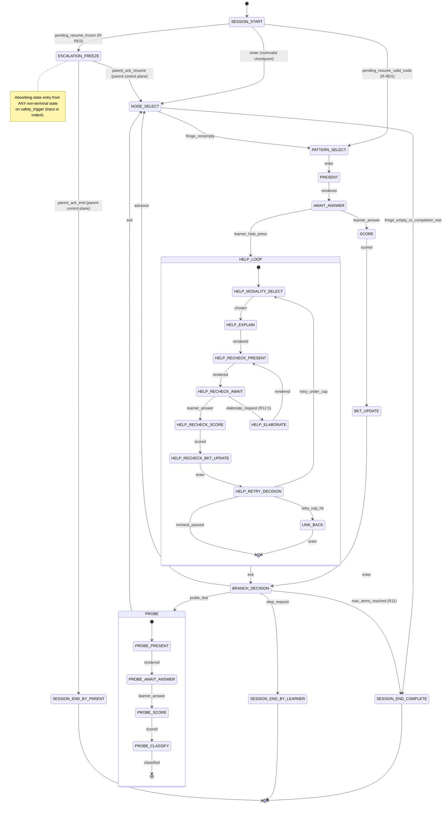

# Mentar — Session State Machine (FSM)

**Workstream:** W6.1 · **Owns:** SPEC §24 #7 · **Tested by:** [TESTS.md](TESTS.md) T3.7 conformance.

This document defines the **canonical** session loop. The dialogue controller (`src/mentar/dialogue/`) MUST implement exactly the states and transitions below — `tests/dialogue/test_session_fsm.py` (T3.7) parses this file's transition table and fails if the controller diverges in either direction (missing transitions OR undocumented transitions reachable at runtime).

When this document and the controller disagree, **this document is authoritative for design**; the controller is updated to match, or this document is updated (with a CHANGELOG entry below) if the design has genuinely shifted. Never silently drift.

---

## 1. High-level diagram

Two **global pre-empt events** can fire from any non-terminal state:

| Event | Goes to | Notes |
|---|---|---|
| `safety_trigger` | `ESCALATION_FREEZE` | Layer 1 input filter OR Layer 3 trigger classifier matched. Logged verbatim per SAFETY.md §3.3. |
| `session_close` | (suspended; state persisted) | Learner or system closes the app. The current state and pending input are written to the response log; next `session_resume` re-enters the persisted state. |

Both pre-empts are encoded as **transitions on every non-terminal state** in §3 — they aren't free-floating.

---

## 2. State table

| ID | Name | Persisted? | Purpose |
|----|------|------------|---------|
| S0 | `SESSION_START` | no | Load learner profile, BKT priors, template; resume any pending state from prior close. |
| S1 | `NODE_SELECT` | no | Compute KST fringe from current mastery state; pick next concept node OR detect completion. |
| S2 | `PATTERN_SELECT` | no | Choose interaction pattern (SPEC §12) from parent's mix + adaptive toggle. |
| S3 | `PRESENT` | no | Render the question via the prompt template (W6.2 registry). |
| S4 | `AWAIT_ANSWER` | **yes** | Block on learner input. |
| S5 | `SCORE` | no | Run deterministic verifier (`src/mentar/eval/verify_numeric.py`); if SAFE_REJECT, treat as a regeneration request (not a learner failure). |
| S6 | `BKT_UPDATE` | no | Update `skill_state` via pyBKT with hinted=0 (cold-correct) for this branch. |
| S7 | `BRANCH_DECISION` | no | Choose: advance / probe / end. Probe trigger rule per [SPEC §14.2 + PHASE0 W5.3]: every 5 items OR (mastery≥0.85 ∧ Help-rate<1 per 10 items), whichever first; respect `probe_frequency_cap`. |
| H0 | `HELP_MODALITY_SELECT` | no | Pick a modality NOT used in this Help chain (SPEC §13.2(1); 5 modalities: visual, concrete, analogy, story, formal). |
| H1 | `HELP_EXPLAIN` | no | Render re-explanation grounded in the node's `grounding` passage (RAG, not free recall). |
| H2 | `HELP_RECHECK_PRESENT` | no | Render a transfer-test (new-surface) re-check question. |
| H3 | `HELP_RECHECK_AWAIT` | **yes** | Block on learner input. **Skip attempts MUST be rejected** (T4.3) — non-scoreable input does not advance. |
| H4 | `HELP_RECHECK_SCORE` | no | Verifier runs. |
| H5 | `HELP_RECHECK_BKT_UPDATE` | no | BKT update with `hinted=1` — applies the hinted-win discount (SPEC §13.2(4); per W3.3 mechanism). |
| H6 | `HELP_RETRY_DECISION` | no | Inspect re-check result and retry counter `n`. n≤2 + failed → retry; n=3 + failed → LINK_BACK; passed → return to BRANCH_DECISION. |
| H7 | `LINK_BACK` | no | Render grounded reference to source material (not a new generation); flag concept `sticking_point`; write parent-alert row. BKT is NOT further penalised by this event. |
| P0 | `PROBE_PRESENT` | no | Render proactive transfer probe (per W5.3 rule + W2.4 frequency cap). |
| P1 | `PROBE_AWAIT_ANSWER` | **yes** | Block on learner input. Skip-attempt rejection same as H3. |
| P2 | `PROBE_SCORE` | no | Verifier runs. |
| P3 | `PROBE_CLASSIFY` | no | Apply [W3.4] false-confidence decision table; if first probe failed AND retry-window not yet exhausted, re-enter `PROBE_PRESENT` with a second transfer variant before final classification. |
| E0 | `ESCALATION_FREEZE` | **yes** | **Absorbing** for child input (SAFETY §3.x) — the freeze is lifted only by the parent control plane (`parent_acknowledge()`, not child-facing `step()`), never by anything the child types. The fixed approved handoff message (SAFETY.md §3.4) is rendered exactly once on entry. |
| T1 | `SESSION_END_COMPLETE` | terminal | All in-template fringe nodes mastered OR parent-defined completion criteria met. |
| T2 | `SESSION_END_BY_LEARNER` | terminal | Learner requested stop. |
| T3 | `SESSION_END_BY_PARENT` | terminal | Parent ended after escalation. |

**Persisted states** are written to `response_log` / `escalation_log` (see `src/mentar/db/schema.sql`) with the full state-machine context needed for `session_resume` to re-enter them losslessly. All other states are transient computations from persisted inputs.

---

## 3. Transition table

Every `(state, event)` pair below is documented. **The T3.7 test parses this table directly** — adding a transition in code requires a row here; removing a row from here requires removing it from code. No undocumented transitions are reachable.

Global pre-empts (apply at every non-terminal state row marked "non-terminal"; listed once for brevity):

| From | Event | To | Side effects |
|------|-------|-----|--------------|
| (any non-terminal) | `safety_trigger` | `ESCALATION_FREEZE` | Verbatim trigger text + trigger class written to `escalation_log`; current state checkpoint written; tutoring output suppressed. |
| (any non-terminal) | `session_close` | (suspended) | Current state + pending answer (if any) written to persistence; process can exit. |

State-specific transitions:

Rows where a state's own input simply leaves it unchanged (e.g. a skip-attempt rejected, or
absorbing ESCALATION_FREEZE) are **not** listed as edges here — "staying put" isn't a
transition, so the T3.7 test doesn't model it as one; see §4 Invariants for that behaviour
instead. `BKT_UPDATE`/`HELP_RECHECK_BKT_UPDATE` share one implementation
(`_do_bkt_update(hinted=...)`) — both list the full destination set the shared function can
reach, since T3.7 checks per-handler, not per-`hinted`-value.

| From | Event | To | Side effects |
|------|-------|-----|--------------|
| `SESSION_START` | `enter` (no pending resume) | `NODE_SELECT` | Load profile, BKT priors, template. |
| `SESSION_START` | `pending_resume_valid_node` | `PATTERN_SELECT` | **R-RES (2026-07-19, BUILT — see §4 note below).** A server-process restart interrupted a session; the checkpointed `current_node_id` is still present and unmastered in this curriculum. Seeds `current_node_id`/`items_completed`/`items_since_probe` from the checkpoint and re-enters the SAME node — but a FRESH item/question, not the literal one on screen (scope decision: same topic, not exact mid-question replay). |
| `SESSION_START` | `pending_resume_frozen` | `ESCALATION_FREEZE` | **R-RES.** The interrupted session was frozen when the process stopped — resumes frozen, UNCONDITIONALLY, regardless of curriculum/node validity (SAFETY §3.x: only the parent control plane may ever lift a freeze). No handoff message is re-sent; `/frozen` renders its fixed message independent of `step()`'s output either way. |
| `NODE_SELECT` | `fringe_nonempty` | `PATTERN_SELECT` | Chosen node id recorded in transition log. **R11 (2026-07-18):** selection policy is `engine/fringe.select_next` — interleaves among fringe nodes (prefers a node ≠ the one just practised) and every `REVIEW_EVERY_N`-th completed item injects spaced review of a mastered-but-stale node (makes the `forgetting_suspect` probe path reachable). Was: first sorted fringe node until mastery. |
| `NODE_SELECT` | `fringe_empty_or_completion_met` | `SESSION_END_COMPLETE` | Completion criteria evaluated per parent config. R11: fires when `select_next` returns None (fringe empty AND no stale-mastered review candidates). |
| `PATTERN_SELECT` | `enter` | `PRESENT` | Chosen pattern id recorded. |
| `PRESENT` | `rendered` | `AWAIT_ANSWER` | Prompt text + template id + version hash logged (per T4.6). |
| `AWAIT_ANSWER` | `learner_answer` | `SCORE` | Answer text + timestamp logged. |
| `AWAIT_ANSWER` | `learner_help_press` (or A21: don't-know / clarifying question) | `HELP_MODALITY_SELECT` | Help retry counter `n` initialised to 1; help_event row written; `help_by_node` set (A5). |
| `AWAIT_ANSWER` | `stop_request` | `SESSION_END_BY_LEARNER` | Learner ended explicitly. |
| `SCORE` | `scored` | `BKT_UPDATE` | CheckOutcome attached to response_log row. |
| `SCORE` | `safe_reject` (< A9's streak cap) | `AWAIT_ANSWER` | Re-ask the SAME question with answer-type-aware guidance; NOT a learner failure; NOT BKT-updated. **Corrected 2026-07-05** — was documented as re-presenting a NEW question (`PRESENT`); the shipped behaviour keeps the same question. |
| `SCORE` | `safe_reject_streak_exhausted` (A9: 3 consecutive on the same question) | `HELP_MODALITY_SELECT` | Routes into the Help loop, unscored — the re-ask loop otherwise has no exit. `help_by_node` NOT set (system-routed, not child-initiated). |
| `BKT_UPDATE` | `enter` (correct) | `BRANCH_DECISION` | `skill_state` row updated. |
| `BKT_UPDATE` | `enter` (wrong, unaided) | `HELP_MODALITY_SELECT` | **Auto-help.** `skill_state` updated (A20: no `learns` credit on this observation); scaffolds instead of revealing the answer. `help_by_node` NOT set (system-routed). |
| `BKT_UPDATE` | *(over-approximation — see note above)* | `HELP_RETRY_DECISION` | Not actually reachable from `BKT_UPDATE` (only from `HELP_RECHECK_BKT_UPDATE`'s `hinted=True` call) — listed because both share `_do_bkt_update` and T3.7 checks per-handler. |
| `BRANCH_DECISION` | `advance` | `NODE_SELECT` | — |
| `BRANCH_DECISION` | `probe_due` | `PROBE_PRESENT` | Probe trigger rule fired per W5.3. |
| `BRANCH_DECISION` | `max_items_reached` | `SESSION_END_COMPLETE` | R11 micro-session cap: after `max_items` completed items the session ends warmly (web default 10 via `MENTAR_SESSION_ITEMS`; `None` = uncapped). Checked before the probe rule. |
| `HELP_MODALITY_SELECT` | `chosen` | `HELP_EXPLAIN` | Modality recorded; must differ from prior modalities in this Help chain. |
| `HELP_MODALITY_SELECT` | `modalities_exhausted` | `LINK_BACK` | All 5 modalities already used in this Help chain. |
| `HELP_EXPLAIN` | `rendered` | `HELP_RECHECK_PRESENT` | Re-explanation logged; A14: arithmetic claims verified, regenerated (bounded) or replaced with the deterministic fallback hint on a verified-wrong claim. |
| `HELP_ELABORATE` | `rendered` | `HELP_RECHECK_PRESENT` | R12.5 (2026-07-18): unpacks the SAME explanation one level deeper (`help_elaborate.md` over `previous_explanation`), same A14 guards as HELP_EXPLAIN (shared handler). |
| `HELP_RECHECK_PRESENT` | `rendered` | `HELP_RECHECK_AWAIT` | Transfer-test question logged; numeric-literal overlap with re-explanation checked < threshold (T4.4). |
| `HELP_RECHECK_AWAIT` | `learner_answer` | `HELP_RECHECK_SCORE` | Answer logged with `hinted=1`. |
| `HELP_RECHECK_AWAIT` | `elaborate_request` ("more"/"explain more", web 💡 button) | `HELP_ELABORATE` | R12.5: only while an explanation is live; capped at ELABORATE_CAP=2 per Help chain (beyond the cap: gentle nudge, no transition). |
| `HELP_RECHECK_AWAIT` | `learner_help_press` (or A21: don't-know / clarifying question) | `HELP_MODALITY_SELECT` | Another Help round instead of scoring it as an answer; `help_by_node` set (A5). |
| `HELP_RECHECK_AWAIT` | `stop_request` | `SESSION_END_BY_LEARNER` | Learner ended explicitly. |
| `HELP_RECHECK_SCORE` | `scored` | `HELP_RECHECK_BKT_UPDATE` | — |
| `HELP_RECHECK_BKT_UPDATE` | `enter` (recheck passed) | `BRANCH_DECISION` | BKT update with hinted-win discount applied (T4.5); exits the Help loop. |
| `HELP_RECHECK_BKT_UPDATE` | *(over-approximation — see note above)* | `HELP_MODALITY_SELECT` | Not actually reachable from `HELP_RECHECK_BKT_UPDATE` (only from `BKT_UPDATE`'s `hinted=False`+wrong call) — listed because both share `_do_bkt_update` and T3.7 checks per-handler. |
| `HELP_RECHECK_BKT_UPDATE` | `enter` (recheck failed) | `HELP_RETRY_DECISION` | BKT updated (A20: no `learns` credit); routed to the retry/modality-exhaustion decision. |
| `HELP_RETRY_DECISION` | `recheck_passed` | `BRANCH_DECISION` | Exit Help loop. |
| `HELP_RETRY_DECISION` | `retry_under_cap` (n < 3, failed) | `HELP_MODALITY_SELECT` | n += 1; pick a different unused modality. |
| `HELP_RETRY_DECISION` | `retry_cap_hit` (n = 3, failed) | `LINK_BACK` | — |
| `LINK_BACK` | `enter` | `BRANCH_DECISION` | Grounded reference rendered; concept flagged `sticking_point`; parent-alert row written; BKT untouched. |
| `PROBE_PRESENT` | `rendered` | `PROBE_AWAIT_ANSWER` | Probe text logged. |
| `PROBE_AWAIT_ANSWER` | `learner_answer` | `PROBE_SCORE` | — |
| `PROBE_AWAIT_ANSWER` | `learner_help_press` (or A21: don't-know / clarifying question) | `HELP_MODALITY_SELECT` | The probe is abandoned; a child needing help is itself useful signal and help must never be refused. `help_by_node` set (A5). |
| `PROBE_AWAIT_ANSWER` | `stop_request` | `SESSION_END_BY_LEARNER` | Learner ended explicitly. |
| `PROBE_SCORE` | `scored` | `PROBE_CLASSIFY` | — |
| `PROBE_CLASSIFY` | `clean_pass` | `NODE_SELECT` | `probe_event` row with class=`clean_pass`; must NOT return to `BRANCH_DECISION` (with mastery ≥ threshold, `probe_due` would re-fire forever). **Corrected 2026-07-05** — was documented as `BRANCH_DECISION`. |
| `PROBE_CLASSIFY` | `retry_needed` (first failure, no retry yet) | `PROBE_PRESENT` | Render second transfer variant before classifying (W3.4 decision table). |
| `PROBE_CLASSIFY` | `classified_as_class` (final, after any retry) | `NODE_SELECT` | `probe_event` row with class ∈ {`false_confidence`, `slip_suspect`, `forgetting_suspect`}; mastery demoted (probe-demote) so the node returns to normal practice instead of being re-probed endlessly. **Corrected 2026-07-05** — was documented as `BRANCH_DECISION`. |
| `ESCALATION_FREEZE` | `alert_sent_and_acked_resume` (parent control plane, not child input) | `NODE_SELECT` | `escalation_log.parent_ack_at` set; outcome=`resumed`. |
| `ESCALATION_FREEZE` | `alert_sent_and_acked_end` (parent control plane) | `SESSION_END_BY_PARENT` | `escalation_log.parent_ack_at` set; outcome=`ended_by_parent`. |

Terminal states (`SESSION_END_COMPLETE`, `SESSION_END_BY_LEARNER`, `SESSION_END_BY_PARENT`) have NO outgoing transitions. They emit a session-summary row and the process exits.

**`PARENT_ACK_WAIT` removed (2026-07-05, A11).** An earlier design had the parent acknowledgment
flow pass through a dedicated `PARENT_ACK_WAIT` state. The shipped implementation never wires
this — `SessionController.parent_acknowledge()` (the `/parent/ack` control-plane method, distinct
from child-facing `step()`) drives resume/end directly out of `ESCALATION_FREEZE`. The state
lingered in the enum and this doc as dead, unreachable documentation; both are now in sync.

---

## 4. Invariants

**Status (2026-07-05, A11):** only #1 is currently automated, by
`tests/dialogue/test_session_fsm.py` (T3.7, static — an AST-derived transition-edge check, not
a runtime fuzzer). #2–#7 are design invariants verified by inspection/targeted unit tests
elsewhere in `tests/dialogue/`, not by a dedicated property-based/fuzz harness — the
`test_session_fsm_invariants.py` file this section previously claimed tests them dynamically
was never built (the exact kind of doc/code drift T3.7 exists to catch). Building that harness
is a legitimate follow-up, not done in this pass.

1. **Total documentation.** Every transition implemented in `src/mentar/dialogue/controller.py` corresponds to a row in §3. Every row in §3 is implemented in code. (Bi-directional — drift in either direction = test failure.) **Automated: `test_session_fsm.py`.**
2. **Absorbing escalation.** From `ESCALATION_FREEZE`, no child-input event advances state — only the parent control plane (`parent_acknowledge()`) can. Covered by `tests/dialogue/test_escalation_resume.py` (fixed scenarios, not a fuzzer).
3. **Persistence completeness.** **BUILT 2026-07-19 (R-RES), deliberately SCOPED DOWN from the original invariant.** A server-process restart resumes onto the SAME topic (`current_node_id`) with the session counters (`items_completed`/`items_since_probe`) intact, and an `ESCALATION_FREEZE` unconditionally resumes frozen — but this is NOT the exact "pending input and counters" byte-for-byte replay the original wording implied: the literal on-screen question, live `Item`, and any in-progress Help/probe sub-state are NOT restored — a fresh item/question is presented for that same node instead. This was a scope decision (simpler, no `Item` serialization or RNG mid-replay, no template-drift edge cases), not an oversight. Covered by `tests/dialogue/test_session_resume.py`, `tests/db/test_datamodel.py` (checkpoint persistence), `tests/web/test_app_smoke.py` (restart simulation).
4. **Help retry cap.** The Help chain length from `HELP_MODALITY_SELECT` entries to `LINK_BACK` is ≤ 3 (SPEC §13.1, W5.3 pilot default N=3). Covered by `tests/dialogue/test_controller.py`'s Help-loop tests.
5. **Probe non-skippability.** From both `HELP_RECHECK_AWAIT` and `PROBE_AWAIT_ANSWER`, `learner_skip_attempt` is a self-loop only — never advances to a downstream tutoring state without a scoreable answer.
6. **Modality diversity.** `HELP_MODALITY_SELECT` MUST pick a modality not already used in the current Help chain; if all 5 are exhausted before retry cap is hit, force `LINK_BACK` early.
7. **Safety pre-empt completeness.** Every non-terminal state honours `safety_trigger`. A property test injects `safety_trigger` from each state and asserts `ESCALATION_FREEZE` is reached within one transition.

---

## 5. Counter and timer state

These flow alongside the FSM and are NOT modeled as separate FSM states (they would explode the diagram). The controller tracks them in plain Python state and snapshots them on `session_close`.

| Counter / timer | Scope | Set | Read | Reset |
|---|---|---|---|---|
| `help_retry_n` | per Help chain on a single concept | on `learner_help_press` (init 1) | in `HELP_RETRY_DECISION` | when leaving Help loop (pass or LINK_BACK) |
| `items_since_probe` | per session | incr in `BRANCH_DECISION` after advance | in `BRANCH_DECISION` to evaluate W5.3 rule | on `PROBE_*` exit |
| `probes_this_session` | per session | incr on `PROBE_PRESENT` entry | in `BRANCH_DECISION` to evaluate `probe_frequency_cap` (W2.4) | per session |
| `help_rate_window` | rolling per skill (last 10 items) | append on `learner_help_press` | in `BRANCH_DECISION` for W5.3 rule | windowed |
| `modalities_used` | per Help chain | append on `HELP_MODALITY_SELECT` | in `HELP_MODALITY_SELECT` for diversity | when leaving Help loop |
| `probe_retry_seen` | per probe pair | set on first probe failure | in `PROBE_CLASSIFY` for retry decision | per probe pair |

---

## 6. Out of scope for this document

- **Detailed prompt templates** — see [prompts/README.md](../prompts/README.md) (W6.2).
- **The verifier itself** — see `src/mentar/eval/verify_numeric.py` and TESTS.md T1.3 / T3.5.
- **BKT mathematics** — see [bkt_notes.md](bkt_notes.md) (T3.3 output).
- **Escalation trigger list** — see [SAFETY.md](SAFETY.md) §3.2 (W2.2 v0.1-interim).
- **Pilot UI surface** — see PHASE0.md W6.3 decision.

---

## 7. Open questions for review

1. **Half-completed Help chain on session close.** §3 persists `HELP_RECHECK_AWAIT`; on resume, the same re-check is presented. Should the modality counter reset? Pilot decision: NO — preserve continuity; `modalities_used` survives. Open whether to expose a "skip this Help and try later" affordance (not in v0.1 — would weaken T4.3).
2. **Probe retry granularity.** §3 currently allows ONE retry in the probe path (first failure → second variant → classify). Should multiple retries be allowed? Pilot decision: NO — keeps the false-confidence classifier crisp. Re-evaluate post-pilot if classification noise is high.
3. **Probe inside a Help chain?** Currently impossible by construction — probes only fire from `BRANCH_DECISION`, which is only reachable AFTER a Help chain exits. Confirmed safe and intentional.
4. **Adaptive toggle states.** §2 puts pattern selection in S2 (`PATTERN_SELECT`). Adaptive toggle logic (SPEC §12) is *inside* that state, not a separate state — it's a computation that produces the chosen pattern. Reviewers: confirm this granularity is right; T3.7 won't catch sub-state logic.

---

## 8. Changelog

| Date | Version | Change |
|------|---------|--------|
| 2026-06-13 | v0.1 | Initial draft (Opus) — owns PHASE0 W6.1. |
| 2026-07-05 | v0.2 | **A11 (T3.7 built).** New `tests/dialogue/test_session_fsm.py` parses §3 mechanically (AST-derived code edges vs. doc edges) — the drift-detector this doc had claimed since v0.1 but never had. Fixing what it found: removed dead `PARENT_ACK_WAIT` state (never wired — `parent_acknowledge()` drives resume/end directly from `ESCALATION_FREEZE`); corrected `SCORE`'s `safe_reject` target (`PRESENT` → `AWAIT_ANSWER`, matches shipped same-question re-ask behaviour) and `PROBE_CLASSIFY`'s two exit targets (`BRANCH_DECISION` → `NODE_SELECT`, matches the probe-demote fix); documented previously-undocumented reachable transitions: auto-help (`BKT_UPDATE`/`SCORE` → `HELP_MODALITY_SELECT`), A21's don't-know/question routing (three `*_AWAIT` states → `HELP_MODALITY_SELECT`), A9's unreadable-streak-cap (`SCORE` → `HELP_MODALITY_SELECT`), and the pre-existing `stop_request` gap in three `*_AWAIT` states. §4 corrected to stop claiming a `test_session_fsm_invariants.py` dynamic/fuzz harness exists (it doesn't — only §4's invariant #1 is currently automated). |
