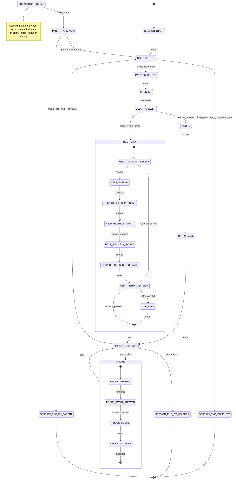

# Mentar — Session State Machine (FSM)

**Workstream:** W6.1 · **Owns:** SPEC §24 #7 · **Tested by:** [TESTS.md](TESTS.md) T3.7 conformance.

This document defines the **canonical** session loop. The dialogue controller (`src/mentar/dialogue/`) MUST implement exactly the states and transitions below — `tests/dialogue/test_session_fsm.py` (T3.7) parses this file's transition table and fails if the controller diverges in either direction (missing transitions OR undocumented transitions reachable at runtime).

When this document and the controller disagree, **this document is authoritative for design**; the controller is updated to match, or this document is updated (with a CHANGELOG entry below) if the design has genuinely shifted. Never silently drift.

---

## 1. High-level diagram

Two **global pre-empt events** can fire from any non-terminal state:

| Event | Goes to | Notes |
|---|---|---|
| `safety_trigger` | `ESCALATION_FREEZE` | Layer 1 input filter OR Layer 3 trigger classifier matched. Logged verbatim per SAFETY.md §3.3. |
| `session_close` | (suspended; state persisted) | Learner or system closes the app. The current state and pending input are written to the response log; next `session_resume` re-enters the persisted state. |

Both pre-empts are encoded as **transitions on every non-terminal state** in §3 — they aren't free-floating.

---

## 2. State table

| ID | Name | Persisted? | Purpose |
|----|------|------------|---------|
| S0 | `SESSION_START` | no | Load learner profile, BKT priors, template; resume any pending state from prior close. |
| S1 | `NODE_SELECT` | no | Compute KST fringe from current mastery state; pick next concept node OR detect completion. |
| S2 | `PATTERN_SELECT` | no | Choose interaction pattern (SPEC §12) from parent's mix + adaptive toggle. |
| S3 | `PRESENT` | no | Render the question via the prompt template (W6.2 registry). |
| S4 | `AWAIT_ANSWER` | **yes** | Block on learner input. |
| S5 | `SCORE` | no | Run deterministic verifier (`src/mentar/eval/verify_numeric.py`); if SAFE_REJECT, treat as a regeneration request (not a learner failure). |
| S6 | `BKT_UPDATE` | no | Update `skill_state` via pyBKT with hinted=0 (cold-correct) for this branch. |
| S7 | `BRANCH_DECISION` | no | Choose: advance / probe / end. Probe trigger rule per [SPEC §14.2 + PHASE0 W5.3]: every 5 items OR (mastery≥0.85 ∧ Help-rate<1 per 10 items), whichever first; respect `probe_frequency_cap`. |
| H0 | `HELP_MODALITY_SELECT` | no | Pick a modality NOT used in this Help chain (SPEC §13.2(1); 5 modalities: visual, concrete, analogy, story, formal). |
| H1 | `HELP_EXPLAIN` | no | Render re-explanation grounded in the node's `grounding` passage (RAG, not free recall). |
| H2 | `HELP_RECHECK_PRESENT` | no | Render a transfer-test (new-surface) re-check question. |
| H3 | `HELP_RECHECK_AWAIT` | **yes** | Block on learner input. **Skip attempts MUST be rejected** (T4.3) — non-scoreable input does not advance. |
| H4 | `HELP_RECHECK_SCORE` | no | Verifier runs. |
| H5 | `HELP_RECHECK_BKT_UPDATE` | no | BKT update with `hinted=1` — applies the hinted-win discount (SPEC §13.2(4); per W3.3 mechanism). |
| H6 | `HELP_RETRY_DECISION` | no | Inspect re-check result and retry counter `n`. n≤2 + failed → retry; n=3 + failed → LINK_BACK; passed → return to BRANCH_DECISION. |
| H7 | `LINK_BACK` | no | Render grounded reference to source material (not a new generation); flag concept `sticking_point`; write parent-alert row. BKT is NOT further penalised by this event. |
| P0 | `PROBE_PRESENT` | no | Render proactive transfer probe (per W5.3 rule + W2.4 frequency cap). |
| P1 | `PROBE_AWAIT_ANSWER` | **yes** | Block on learner input. Skip-attempt rejection same as H3. |
| P2 | `PROBE_SCORE` | no | Verifier runs. |
| P3 | `PROBE_CLASSIFY` | no | Apply [W3.4] false-confidence decision table; if first probe failed AND retry-window not yet exhausted, re-enter `PROBE_PRESENT` with a second transfer variant before final classification. |
| E0 | `ESCALATION_FREEZE` | **yes** | **Absorbing.** No tutoring turns generated. The fixed approved handoff message (SAFETY.md §3.4) is rendered exactly once on entry. |
| E1 | `PARENT_ACK_WAIT` | **yes** | Wait for parent acknowledgment. Parent chooses: end the session OR resume from `NODE_SELECT`. |
| T1 | `SESSION_END_COMPLETE` | terminal | All in-template fringe nodes mastered OR parent-defined completion criteria met. |
| T2 | `SESSION_END_BY_LEARNER` | terminal | Learner requested stop. |
| T3 | `SESSION_END_BY_PARENT` | terminal | Parent ended after escalation. |

**Persisted states** are written to `response_log` / `escalation_log` (see `src/mentar/db/schema.sql`) with the full state-machine context needed for `session_resume` to re-enter them losslessly. All other states are transient computations from persisted inputs.

---

## 3. Transition table

Every `(state, event)` pair below is documented. **The T3.7 test parses this table directly** — adding a transition in code requires a row here; removing a row from here requires removing it from code. No undocumented transitions are reachable.

Global pre-empts (apply at every non-terminal state row marked "non-terminal"; listed once for brevity):

| From | Event | To | Side effects |
|------|-------|-----|--------------|
| (any non-terminal) | `safety_trigger` | `ESCALATION_FREEZE` | Verbatim trigger text + trigger class written to `escalation_log`; current state checkpoint written; tutoring output suppressed. |
| (any non-terminal) | `session_close` | (suspended) | Current state + pending answer (if any) written to persistence; process can exit. |

State-specific transitions:

| From | Event | To | Side effects |
|------|-------|-----|--------------|
| `SESSION_START` | `enter` (no pending resume) | `NODE_SELECT` | Load profile, BKT priors, template. |
| `SESSION_START` | `enter` (pending resume found) | (persisted state) | Resume into the persisted state with its checkpoint context. |
| `NODE_SELECT` | `fringe_nonempty` | `PATTERN_SELECT` | Chosen node id recorded in transition log. |
| `NODE_SELECT` | `fringe_empty_or_completion_met` | `SESSION_END_COMPLETE` | Completion criteria evaluated per parent config. |
| `PATTERN_SELECT` | `enter` | `PRESENT` | Chosen pattern id recorded. |
| `PRESENT` | `rendered` | `AWAIT_ANSWER` | Prompt text + template id + version hash logged (per T4.6). |
| `AWAIT_ANSWER` | `learner_answer` | `SCORE` | Answer text + timestamp logged. |
| `AWAIT_ANSWER` | `learner_help_press` | `HELP_MODALITY_SELECT` | Help retry counter `n` initialised to 1; help_event row written. |
| `AWAIT_ANSWER` | `session_resume` (from persisted) | `AWAIT_ANSWER` | Re-enter same state; pending prompt re-rendered. |
| `SCORE` | `scored` | `BKT_UPDATE` | CheckOutcome attached to response_log row. |
| `SCORE` | `safe_reject` | `PRESENT` | Regenerate the question; do NOT count as learner failure; do NOT BKT-update. |
| `BKT_UPDATE` | `enter` | `BRANCH_DECISION` | `skill_state` row updated. |
| `BRANCH_DECISION` | `advance` | `NODE_SELECT` | — |
| `BRANCH_DECISION` | `probe_due` | `PROBE_PRESENT` | Probe trigger rule fired per W5.3. |
| `BRANCH_DECISION` | `stop_request` | `SESSION_END_BY_LEARNER` | Learner ended explicitly. |
| `HELP_MODALITY_SELECT` | `chosen` | `HELP_EXPLAIN` | Modality recorded; must differ from prior modalities in this Help chain. |
| `HELP_EXPLAIN` | `rendered` | `HELP_RECHECK_PRESENT` | Re-explanation logged. |
| `HELP_RECHECK_PRESENT` | `rendered` | `HELP_RECHECK_AWAIT` | Transfer-test question logged; numeric-literal overlap with re-explanation checked < threshold (T4.4). |
| `HELP_RECHECK_AWAIT` | `learner_answer` | `HELP_RECHECK_SCORE` | Answer logged with `hinted=1`. |
| `HELP_RECHECK_AWAIT` | `learner_skip_attempt` | `HELP_RECHECK_AWAIT` | Skip rejected; gentle re-prompt; state unchanged (T4.3). |
| `HELP_RECHECK_AWAIT` | `session_resume` | `HELP_RECHECK_AWAIT` | Restore pending re-check from persistence (T4.3 reopen case). |
| `HELP_RECHECK_SCORE` | `scored` | `HELP_RECHECK_BKT_UPDATE` | — |
| `HELP_RECHECK_BKT_UPDATE` | `enter` | `HELP_RETRY_DECISION` | BKT update with hinted-win discount applied (T4.5). |
| `HELP_RETRY_DECISION` | `recheck_passed` | `BRANCH_DECISION` | Exit Help loop. |
| `HELP_RETRY_DECISION` | `retry_under_cap` (n < 3, failed) | `HELP_MODALITY_SELECT` | n += 1; pick a different unused modality. |
| `HELP_RETRY_DECISION` | `retry_cap_hit` (n = 3, failed) | `LINK_BACK` | — |
| `LINK_BACK` | `enter` | `BRANCH_DECISION` | Grounded reference rendered; concept flagged `sticking_point`; parent-alert row written; BKT untouched. |
| `PROBE_PRESENT` | `rendered` | `PROBE_AWAIT_ANSWER` | Probe text logged. |
| `PROBE_AWAIT_ANSWER` | `learner_answer` | `PROBE_SCORE` | — |
| `PROBE_AWAIT_ANSWER` | `learner_skip_attempt` | `PROBE_AWAIT_ANSWER` | Skip rejected (T5.1: non-skippable). |
| `PROBE_AWAIT_ANSWER` | `session_resume` | `PROBE_AWAIT_ANSWER` | Restore pending probe. |
| `PROBE_SCORE` | `scored` | `PROBE_CLASSIFY` | — |
| `PROBE_CLASSIFY` | `clean_pass` | `BRANCH_DECISION` | `probe_event` row with class=`clean_pass`. |
| `PROBE_CLASSIFY` | `retry_needed` (first failure, no retry yet) | `PROBE_PRESENT` | Render second transfer variant before classifying (W3.4 decision table). |
| `PROBE_CLASSIFY` | `classified_as_class` | `BRANCH_DECISION` | `probe_event` row with class ∈ {`false_confidence`, `slip_suspect`, `forgetting_suspect`}. |
| `ESCALATION_FREEZE` | (any event other than parent_ack) | `ESCALATION_FREEZE` | **Absorbing.** Input ignored; logged as `freeze_held`. |
| `ESCALATION_FREEZE` | `alert_sent` | `PARENT_ACK_WAIT` | Parent alert row written; UI surfaces alert flag. |
| `PARENT_ACK_WAIT` | `parent_ack_end` | `SESSION_END_BY_PARENT` | `escalation_log.parent_ack_at` set; outcome=`ended_by_parent`. |
| `PARENT_ACK_WAIT` | `parent_ack_resume` | `NODE_SELECT` | `escalation_log.parent_ack_at` set; outcome=`resumed`. |
| `PARENT_ACK_WAIT` | (any non-ack event) | `PARENT_ACK_WAIT` | Tutoring stays frozen until ack. |

Terminal states (`SESSION_END_COMPLETE`, `SESSION_END_BY_LEARNER`, `SESSION_END_BY_PARENT`) have NO outgoing transitions. They emit a session-summary row and the process exits.

---

## 4. Invariants

These are checked statically by T3.7 and dynamically by `tests/dialogue/test_session_fsm_invariants.py`:

1. **Total documentation.** Every transition implemented in `src/mentar/dialogue/controller.py` corresponds to a row in §3. Every row in §3 is implemented in code. (Bi-directional — drift in either direction = test failure.)
2. **Absorbing escalation.** From `ESCALATION_FREEZE`, no event except `alert_sent` (internal) or `parent_ack_*` advances state. Property-tested with a fuzzed event stream.
3. **Persistence completeness.** Every state marked "persisted" in §2 must be re-enterable from `SESSION_START` after a `session_close` checkpoint, with the pending input and counters intact. Tested via close-and-reopen scenarios (T4.3 for help; T3.7.4 for the general case).
4. **Help retry cap.** The Help chain length from `HELP_MODALITY_SELECT` entries to `LINK_BACK` is ≤ 3 (SPEC §13.1, W5.3 pilot default N=3).
5. **Probe non-skippability.** From both `HELP_RECHECK_AWAIT` and `PROBE_AWAIT_ANSWER`, `learner_skip_attempt` is a self-loop only — never advances to a downstream tutoring state without a scoreable answer.
6. **Modality diversity.** `HELP_MODALITY_SELECT` MUST pick a modality not already used in the current Help chain; if all 5 are exhausted before retry cap is hit, force `LINK_BACK` early.
7. **Safety pre-empt completeness.** Every non-terminal state honours `safety_trigger`. A property test injects `safety_trigger` from each state and asserts `ESCALATION_FREEZE` is reached within one transition.

---

## 5. Counter and timer state

These flow alongside the FSM and are NOT modeled as separate FSM states (they would explode the diagram). The controller tracks them in plain Python state and snapshots them on `session_close`.

| Counter / timer | Scope | Set | Read | Reset |
|---|---|---|---|---|
| `help_retry_n` | per Help chain on a single concept | on `learner_help_press` (init 1) | in `HELP_RETRY_DECISION` | when leaving Help loop (pass or LINK_BACK) |
| `items_since_probe` | per session | incr in `BRANCH_DECISION` after advance | in `BRANCH_DECISION` to evaluate W5.3 rule | on `PROBE_*` exit |
| `probes_this_session` | per session | incr on `PROBE_PRESENT` entry | in `BRANCH_DECISION` to evaluate `probe_frequency_cap` (W2.4) | per session |
| `help_rate_window` | rolling per skill (last 10 items) | append on `learner_help_press` | in `BRANCH_DECISION` for W5.3 rule | windowed |
| `modalities_used` | per Help chain | append on `HELP_MODALITY_SELECT` | in `HELP_MODALITY_SELECT` for diversity | when leaving Help loop |
| `probe_retry_seen` | per probe pair | set on first probe failure | in `PROBE_CLASSIFY` for retry decision | per probe pair |

---

## 6. Out of scope for this document

- **Detailed prompt templates** — see [PROMPTS.md](PROMPTS.md) (W6.2).
- **The verifier itself** — see `src/mentar/eval/verify_numeric.py` and TESTS.md T1.3 / T3.5.
- **BKT mathematics** — see [bkt_notes.md](bkt_notes.md) (T3.3 output).
- **Escalation trigger list** — see [SAFETY.md](SAFETY.md) §3.2 (W2.2 v0.1-interim).
- **Pilot UI surface** — see PHASE0.md W6.3 decision.

---

## 7. Open questions for review

1. **Half-completed Help chain on session close.** §3 persists `HELP_RECHECK_AWAIT`; on resume, the same re-check is presented. Should the modality counter reset? Pilot decision: NO — preserve continuity; `modalities_used` survives. Open whether to expose a "skip this Help and try later" affordance (not in v0.1 — would weaken T4.3).
2. **Probe retry granularity.** §3 currently allows ONE retry in the probe path (first failure → second variant → classify). Should multiple retries be allowed? Pilot decision: NO — keeps the false-confidence classifier crisp. Re-evaluate post-pilot if classification noise is high.
3. **Probe inside a Help chain?** Currently impossible by construction — probes only fire from `BRANCH_DECISION`, which is only reachable AFTER a Help chain exits. Confirmed safe and intentional.
4. **Adaptive toggle states.** §2 puts pattern selection in S2 (`PATTERN_SELECT`). Adaptive toggle logic (SPEC §12) is *inside* that state, not a separate state — it's a computation that produces the chosen pattern. Reviewers: confirm this granularity is right; T3.7 won't catch sub-state logic.

---

## 8. Changelog

| Date | Version | Change |
|------|---------|--------|
| 2026-06-13 | v0.1 | Initial draft (Opus) — owns PHASE0 W6.1. |
