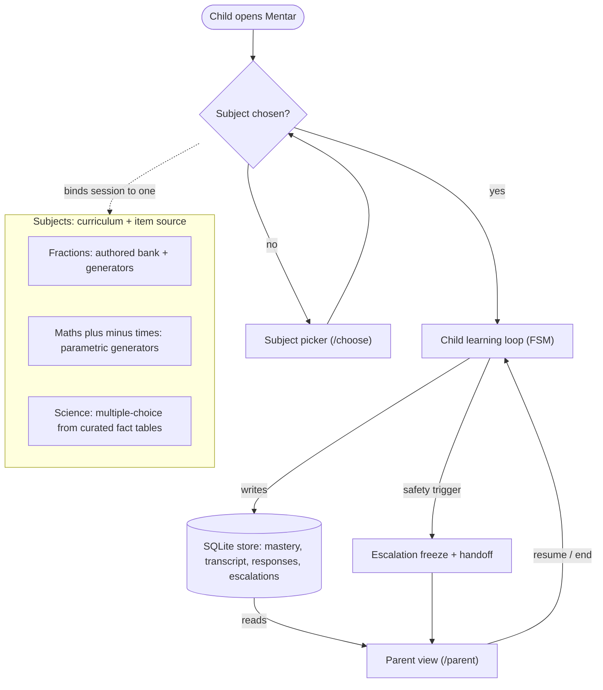
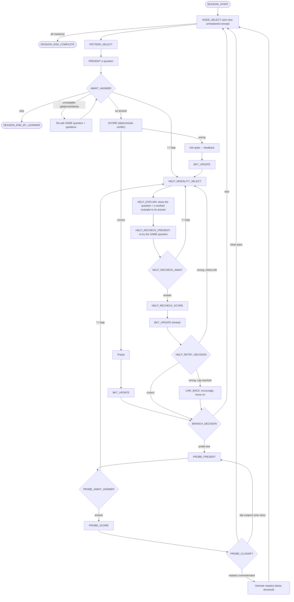
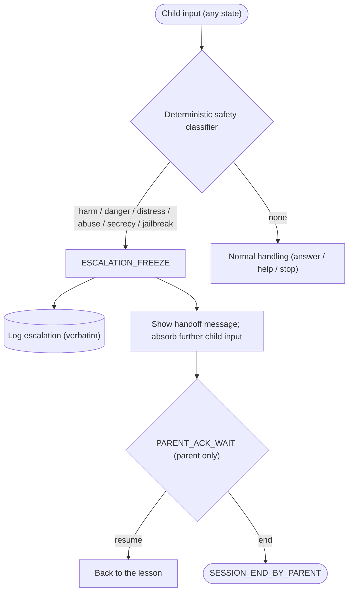
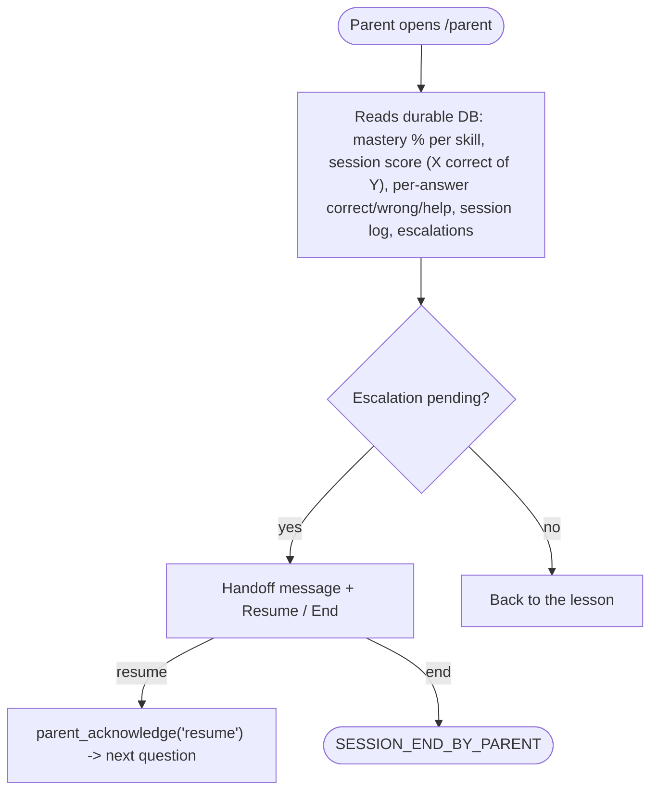

# Mentar — interaction flow

How a session actually flows, separated into **subject selection**, the **child** learning loop,
and the **parent** oversight view, with **safety** as a cross-cutting pre-empt. Grounded in
`dialogue/controller.py` (the FSM) and `web/app.py` (routes). Diagrams are Mermaid (render on
GitHub / most viewers).

Key invariants the flow guarantees:
- **The deterministic verifier scores answers — never the LLM** (`eval/verify_numeric.py`).
- **Safety classification runs first** on every child input and pre-empts everything.
- **One question at a time** is live for the child.
- The **LLM only generates inside bounded states** (present / explain), never open chat.

---

## 1. System overview — subjects, child, parent

| Subject | Answer types | Item source | Scored by |
|---|---|---|---|
| **Fractions** | int, fraction, mc4 | authored item bank + parametric generators | `int_exact` / `fraction_equiv` / `mc_choice` |
| **Maths +−×** | int | parametric generators (computed answers) | `int_exact` |
| **Science** | mc4 | generated MC from curated fact tables (ground truth = the table) | `mc_choice` |

Switching subject starts a **fresh session** (new controller + `session_id`); `skill_state` is
keyed by concept id, which is distinct across subjects, so there is no cross-subject collision.

---

## 2. Child learning loop (the FSM)

Notes:
- **Auto-help on wrong:** a wrong *unaided* answer gives feedback (without revealing the answer)
  and routes into the Help loop, rather than advancing.
- **Help = one question:** the explanation shows `Q) <the question>` + a worked example *to its
  answer*; the child re-tries the **same** question ("Now you try it!"). Any extra question the
  model appends is stripped.
- **Probes confirm then advance:** a clean probe advances (the mastered node leaves the fringe); a
  failed probe demotes mastery so the node returns to **normal feedback practice** (this fixed the
  endless-silent-probe bug).
- **Open modelling decisions** (see PHASE0_STATUS): mastery rising after wrong answers; broader
  child-intent recognition ("I don't know", clarify, off-topic) — `design/INTERACTION_SCOPE.md`.

---

## 3. Safety pre-empt (cross-cutting)

Runs first on **every** child input, in every awaiting state, before any scoring or help.

The freeze is **absorbing for child input** — a child can never unfreeze a session by typing; only
the parent control plane (`/parent/ack`) transitions out of it.

---

## 4. Parent view (oversight)

The parent view is **read-mostly** (durable transcript + mastery from the DB); its only write is
acknowledging an escalation (resume/end). It does not drive the tutoring FSM otherwise.

---

## 5. Where to look in the code

| Flow piece | Code |
|---|---|
| Child FSM (all states) | `src/mentar/dialogue/controller.py` |
| Scoring (deterministic) | `src/mentar/eval/verify_numeric.py` |
| Mastery (BKT) | `src/mentar/engine/bkt.py` |
| Item sources / generators | `src/mentar/engine/itembank.py`, `itemgen.py`, `science_items.py` |
| Safety classifier + handoff | `src/mentar/safety/escalation.py` |
| Web routes, subject picker, parent view | `src/mentar/web/app.py`, `templates/` |
| Curricula | `curriculum/templates/_pilot/*.md` |
